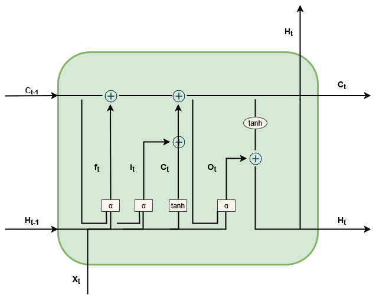
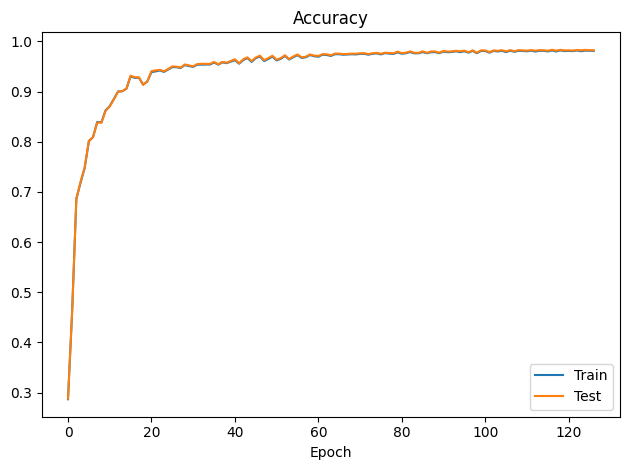
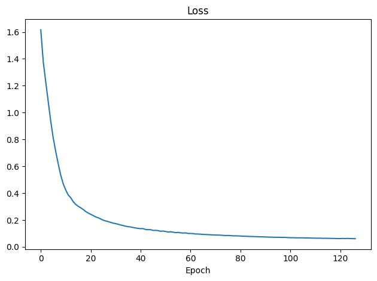
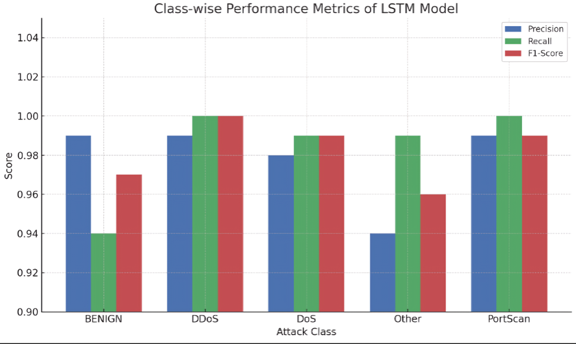
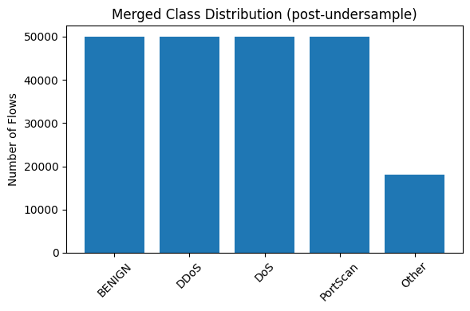

# Towards a Serverless Intelligent Firewall: AI-Driven Security, and Zero-Trust Architectures

**Research Paper #1 — Serverless Intelligent Firewall Series** | **Published in IEEE, 2025**

> **Authors:** Md Anisur Rahman Chowdhury\*, Hoang Nam Dang, Dr. Ronny Bazan-Antequera *(Gannon University, USA)* · Md. Sayham Khan, Md Razaul Karim *(University of the Potomac, USA)* · Dr. Sheheeda Manakkadu *(Gannon University, USA)*

---

## Research Portal

| Resource | Link |
|----------|------|
| **Website** | [https://anis151993.github.io/Serverless-Intelligent-Firewall-Research-1/](https://anis151993.github.io/Serverless-Intelligent-Firewall-Research-1/) |
| **40-Page Research Report** | [View Online](https://anis151993.github.io/Serverless-Intelligent-Firewall-Research-1/report.html) |
| **Interactive Poster** | [View Poster](https://anis151993.github.io/Serverless-Intelligent-Firewall-Research-1/poster.html) |
| **YouTube Walkthrough** | [https://youtu.be/K04bOFbv204](https://youtu.be/K04bOFbv204) |

---

## Abstract

The stateful and transient nature of serverless computing environments presents significant challenges to traditional network security, particularly in implementing Zero-Trust Architecture (ZTA) principles. This work proposes a **Serverless Intelligent Firewall framework** combining deep learning-based intrusion detection with Zero-Trust enforcement. The LSTM architecture achieved **98% accuracy, precision, recall, and F1-score** on CICIDS2017, outperforming DT, SVM, and CNN baselines.

**Keywords:** Serverless computing · Intelligent Firewall · ZTA · LSTM · Deep Learning · CICIDS2017 · Cybersecurity

---

## Key Results

| Model | Accuracy | Precision | Recall | F1-Score |
|-------|:--------:|:---------:|:------:|:--------:|
| SVM | 88.40% | 84.10% | 77.80% | 80.80% |
| Decision Tree | 90.20% | 87.60% | 81.30% | 84.30% |
| CNN | 93.00% | 95.10% | 85.40% | 89.90% |
| **LSTM (Proposed)** | **98.00%** | **98.00%** | **98.00%** | **98.00%** |

> Statistical significance: paired t-test **p < 0.05** vs. CNN and SVM.

---

## Result Figures

### Figure 1 — Research Methodology


*End-to-end research methodology: CICIDS2017 dataset → preprocessing → LSTM training → AWS Lambda serverless deployment → Zero-Trust enforcement.*

---

### Figure 2 — LSTM Model Architecture



*3-layer LSTM architecture with forget gate, input gate, cell state update, and output gate at each time step t.*

---

### Figure 3 — Training & Validation Accuracy



*LSTM training and validation accuracy over 130 epochs. Reaches ~98% after epoch 60. Train and test curves closely aligned — no overfitting.*

---

### Figure 4 — Training & Validation Loss



*Loss drops from >1.6 to <0.4 in the first 20 epochs, stabilizing at ~0.05 by epoch 60. Smooth convergence with no instability.*

---

### Figure 5 — Confusion Matrix


*LSTM confusion matrix across 5 classes. DDoS: 9,989/10,000 · PortScan: 9,982/10,000 · DoS: 9,909 · BENIGN: 9,446 · Other: 3,556/3,606. Large diagonal, minimal off-diagonal noise.*

---

### Figure 6 — Class-wise LSTM Performance



*Per-class precision and recall for the LSTM model. DDoS and PortScan achieve near-perfect scores. "Other" (rare attacks) maintains recall=0.99, demonstrating robustness to underrepresented classes.*

---

### Figure 7 — Additional Evaluation Results



---

## LSTM Class-wise Table

| Class | Precision | Recall | F1-Score | Correct / Total |
|-------|:---------:|:------:|:--------:|:---------------:|
| BENIGN | 0.99 | 0.94 | 0.96 | 9,446 / ~10,000 |
| DDoS | 0.99 | 1.00 | 0.99 | 9,989 / 10,000 |
| DoS | 0.98 | 0.99 | 0.98 | 9,909 / ~10,000 |
| PortScan | 0.99 | 1.00 | 0.99 | 9,982 / 10,000 |
| Other | 0.94 | 0.99 | 0.96 | 3,556 / 3,606 |
| **Macro Avg** | **0.978** | **0.984** | **0.976** | — |

---

## SOTA Comparison

| Reference | Dataset | Model | Accuracy |
|-----------|---------|-------|:--------:|
| **Proposed (Ours)** | CIC-IDS2017 | **LSTM** | **98.00%** |
| Altunay et al. (2023) | UNSW-NB15 | Hybrid CNN+LSTM | 93.21% |
| Bamber et al. (2025) | CIC-IDS2017 | Hybrid CNN-LSTM | 95.00% |
| Neto et al. FedSA (2022) | CIC-IDS2017 | Federated IDS | 97.00% |

---

## LSTM Configuration

| Parameter | Value |
|-----------|-------|
| Architecture | 3-Layer LSTM |
| Hidden Units | 128 → 64 → 32 |
| Dropout | 0.3 |
| Dense Layer | 64 units (ReLU) |
| Output | Softmax (5 classes) |
| Loss | Categorical Cross-Entropy |
| Optimizer | Adam (lr = 0.001) |
| Batch Size | 64 |
| Epochs | 120 (Early stop: patience=10) |
| Split | 80% train / 20% test (stratified) |

---

## Paper Access Policy

> The research paper PDFs are **password-protected**.
>
> To request access:
> 1. Follow [GitHub @ANIS151993](https://github.com/ANIS151993)
> 2. Subscribe on [YouTube](https://youtu.be/K04bOFbv204) and like the video
> 3. Email `engr.aanis@gmail.com` with your name, institution, and purpose
> 4. Receive the password from the author

The abstract is always public. The 40-page report and interactive poster are **open to all**.

---

## Repository Structure

```
.
├── docs/                         # GitHub Pages website
│   ├── index.html                # Main research portal
│   ├── report.html               # 40-page comprehensive report
│   ├── poster.html               # Interactive research poster
│   ├── styles.css / script.js    # Styling and interactivity
│   └── assets/
│       ├── images/               # All result figures
│       └── papers/               # Password-protected PDFs
├── intelligent-firewall-AI-Model/# AI model (notebooks, lambda, Docker)
├── main.tex                      # IEEE LaTeX source
├── Bibliography.bib              # BibTeX references
└── README.md
```

---

## Citation

```bibtex
@article{chowdhury2025serverless,
  title   = {Towards a Serverless Intelligent Firewall: AI-Driven Security, and Zero-Trust Architectures},
  author  = {Chowdhury, Md Anisur Rahman and Dang, Hoang Nam and
             Bazan-Antequera, Ronny and Khan, Md. Sayham and
             Karim, Md Razaul and Manakkadu, Sheheeda},
  journal = {IEEE},
  year    = {2025}
}
```

---

**Contact:** engr.aanis@gmail.com | *© 2025 Md Anisur Rahman Chowdhury et al. Published in IEEE.*
